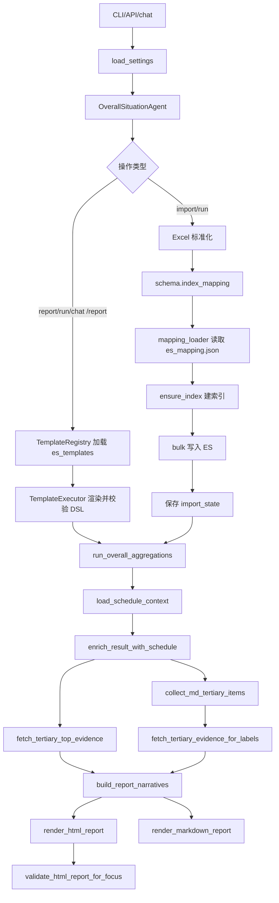

# 整体情况分析 Agent 内部说明

本文档记录当前项目的真实运行方式、数据流程、ES 索引与模板机制、统计口径、LLM 使用位置、API 能力和排障入口。

## 1. 项目定位

`overall_situation_agent` 是一个本地 Python 工具，用于把已打标的 Excel 服务数据导入 Elasticsearch，并生成报告中的“一、整体情况”章节。

当前项目已经重构为“ES mapping + ES template”驱动：

- `es_mapping.json` 是真实建索引来源。
- `es_templates/*.json` 是报告生成与自然语言查询共用的 ES 查询模板库。
- Python 代码负责字段清洗、模板渲染、ES 查询执行、结果标准化、报告渲染和安全校验。
- LLM 只生成自然语言总结，不负责创造统计数字。

当前项目不是 LangChain agent，也没有 LangChain tool registry。交互式能力由 `InteractiveOverallSituationApp`、`ESQueryBuilder`、`QueryPlan`、`AgentState` 和 `OpenAICompatibleClient` 自研组合实现。

## 2. 当前目录结构

```text
overall_situation_agent/
  agent.py
  api.py
  aggregations.py
  cli.py
  config.py
  es_client.py
  es_query_builder.py
  evidence.py
  excel_loader.py
  importer.py
  interactive_app.py
  llm_client.py
  mapping_loader.py
  markdown_renderer.py
  narrative_builder.py
  report.py
  report_context.py
  schedule_loader.py
  schema.py
  taxonomy.py
  template_executor.py
  template_registry.py
  validator.py
es_mapping.json
es_templates/
  00_common_*.json
  01_distribution_*.json
  02_primary_*.json
  03_trend_*.json
  90_runtime_*.json
tests/
outputs/
logs/
README.md
README.internal.md
SPEC.md
requirements.txt
.env.example
```

模板分两类：

- `00_*` 到 `03_*`：面向正常人提问 LLM 的业务查询模板，顶层严格为 `question`、`description`、`dsl`。
- `90_runtime_*`：报告运行时模板，把原来 Python 中的硬编码 ES DSL 外置，保证报告链路也只通过模板查询 ES。

## 3. 运行命令

安装依赖：

```powershell
python -m pip install -r requirements.txt
```

导入数据：

```powershell
python -m overall_situation_agent.cli import --input "..\data\input.xlsx" --recreate-index
```

生成报告：

```powershell
python -m overall_situation_agent.cli report --schedule-input "..\data\schedule.xlsx"
```

导入并生成报告：

```powershell
python -m overall_situation_agent.cli run --input "..\data\input.xlsx" --schedule-input "..\data\schedule.xlsx"
```

启动交互式智能体：

```powershell
python -m overall_situation_agent.cli chat --schedule-input "..\data\schedule.xlsx"
```

在 `chat` 中生成报告：

```text
/report
```

启动 API 服务：

```powershell
python -m overall_situation_agent.cli serve --host 127.0.0.1 --port 8000
```

## 4. 配置项

`.env` 从项目根目录读取。

Elasticsearch：

- `ES_URL`
- `ES_INDEX`
- `ES_USERNAME`
- `ES_PASSWORD`
- `ES_VERIFY_CERTS`

LLM：

- `LLM_BASE_URL`
- `LLM_MODEL`
- `LLM_API_KEY`
- `DEEPSEEK_API_KEY`
- `LLM_TIMEOUT_SECONDS`
- `LLM_MAX_RETRIES`
- `LLM_REPORT_ENABLED`
- `LLM_REPORT_TIMEOUT_SECONDS`
- `LLM_REPORT_MAX_RETRIES`
- `LLM_REPORT_MAX_TOKENS`

本地路径：

- `IMPORT_BATCH_SIZE`
- `OUTPUTS_DIR`
- `LOGS_DIR`
- `IMPORT_STATE_FILE`

当前报告生成要求报告 LLM 可用：`LLM_REPORT_ENABLED=true` 且存在 API Key。统计数字仍全部来自 ES 聚合和代码计算，不由 LLM 生成。

## 5. 总体流程



## 6. Excel 导入

`excel_loader.iter_tagged_feedback()` 使用 `openpyxl` 流式读取 Excel。

Sheet 选择：

- 优先读取 `打标结果`
- 若不存在，则扫描表头，优先选择包含工单标识和内容字段的 sheet
- 都不匹配时使用第一个 sheet

行级处理：

- 中文表头通过 `FIELD_ALIASES` 映射为标准字段
- 空值、数字、日期、多值字段统一清洗
- `label_group` 支持 JSON list 和普通分隔符
- `content` 按 `complaint_content -> content -> model_reasoning -> latent_need` 兜底
- `match_info` 可解析为 `match_label`
- 没有 `gd_identity` 且没有 `content` 的行会丢弃

## 7. ES 索引

`schema.index_mapping()` 不再硬编码 mapping，而是调用 `mapping_loader.load_index_mapping()` 读取根目录 `es_mapping.json`。

`es_mapping.json` 的结构是 ES create-index body：

- `settings.number_of_shards=1`
- `settings.number_of_replicas=0`
- `settings.analysis.analyzer.migu_analyzer`
- `settings.analysis.analyzer.migu_search_analyzer`
- `mappings.dynamic=true`
- `mappings.properties`
- `mappings._meta.field_catalog`

说明性字段不放在 `properties.<field>.meta`，统一放入 `_meta.field_catalog`。这样 mapping 可以直接用于 ES 建索引，同时保留中文表头、用途、多值、转换规则等人工复核信息。

文本字段使用：

- index analyzer: `migu_analyzer`
- search analyzer: `migu_search_analyzer`

因此本机 ES 必须安装 IK 分词插件，提供 `ik_max_word` 和 `ik_smart`。

## 8. 本机 ES 与 IK 插件

本机已验证的 ES 路径：

```text
C:\tools\elasticsearch-9.3.3
```

安装命令示例：

```powershell
C:\tools\elasticsearch-9.3.3\bin\elasticsearch-plugin.bat install --batch https://release.infinilabs.com/analysis-ik/stable/elasticsearch-analysis-ik-9.3.3.zip
```

安装后需要重启 ES。

验证插件：

```powershell
curl http://localhost:9200/_cat/plugins?v
```

验证 analyzer：

```powershell
curl -X POST "http://localhost:9200/_analyze" -H "Content-Type: application/json" -d "{\"analyzer\":\"ik_smart\",\"text\":\"用户退订困难\"}"
```

如果缺少 IK，`ensure_index()` 会在 `es_client.py` 中给出明确错误，提示安装匹配版本的 analysis-ik 插件。

## 9. ES 写入

写入逻辑：

- `_id` 优先使用 `gd_identity`
- 缺失时使用 `<文件名>-<行号>`
- bulk 导入前临时关闭 refresh
- 导入后恢复 refresh 并 refresh index
- chunk 默认 500 条
- 对超时、429、503、504 等错误执行 chunk 二分重试

重复导入判断：

- 文件或目录导入状态写入 `logs/import_state.json`
- 同一输入且索引已有数据时跳过
- 输入变化时自动重建索引，除非调用方选择保留索引

## 10. ES 模板

入口模块：

- `template_registry.py`
- `template_executor.py`

模板文件约束：

- 顶层只能包含 `question`、`description`、`dsl`
- `dsl` 是 Elasticsearch `_search` body
- 支持 `{{start_date}}`、`{{end_date_exclusive}}`、`{{primary_label}}`、`{{tertiary_label}}`、`{{sample_size}}` 等占位符
- 执行前统一做安全校验

禁止能力：

- 写入类 API
- script
- runtime mappings
- pipeline
- suggest
- profile
- explain
- version

`TemplateExecutor` 只负责渲染、校验和执行模板，不负责解释业务含义。

## 11. 聚合统计

入口：`run_overall_aggregations()`。

报告主聚合已经迁移到：

```text
es_templates/90_runtime_overall_aggregations.json
es_templates/90_runtime_total_with_unlabeled.json
es_templates/90_runtime_unlabeled_analysis.json
es_templates/90_runtime_unlabeled_trend_analysis.json
```

Python 代码继续负责：

- 模板参数组装
- 聚合结果标准化
- `total_with_unlabeled` 与 `total` 口径拆分
- 日期趋势补齐
- 未标注分析标准化
- 赛程上下文合并

主统计：

- 总量与数据周期
- 一级、二级、三级标签
- 情绪、服务类型、省份、来源文件
- 客户诉求、客服动作、隐性需求
- 会员类型聚类
- 营销活动页面、匹配状态、匹配关键词
- 年龄、性别、时段、比赛标签
- 标签层级关系
- 按日趋势和按日 TOP 维度
- 未标注数据分布与趋势

口径：

- `total_with_unlabeled` 是全量服务数据
- `total` 是已标注一级标签数据
- 主标签分布排除未标注数据
- 未标注数据单独生成分析块

## 12. 赛程文件

入口：`load_schedule_context(schedule_input)`。

赛程表头需要包含：

- `轮次`
- `日期`
- `主队`
- `客队`
- `城市`
- `时间`

赛程表不批量写入主工单索引。解析结果只作为报告上下文，并按 `service_time` 日聚合结果与赛程日期等值匹配。

合入 `daily` 的字段：

- `is_matchday`
- `matchday`
- `match_summary`

## 13. 证据抽样

报告证据入口：

- `fetch_tertiary_top_evidence()`
- `fetch_tertiary_evidence_for_labels()`

ES 查询智能体证据入口：

- `build_tertiary_evidence_package()`

证据查询模板：

```text
es_templates/90_runtime_tertiary_cause_top.json
es_templates/90_runtime_tertiary_cause_sample_for_query.json
es_templates/90_runtime_tertiary_report_top_buckets.json
es_templates/90_runtime_tertiary_report_sample_for_label.json
```

报告证据用于：

- TOP 三级问题深度分析
- Markdown 分章三级标签分析
- LLM `tertiary_cause_detail`

抽样会清洗原始对话、客服模板话术、超长流水号和冗余空白。

## 14. LLM 叙事

入口：`build_report_narratives(result, llm)`。

LLM 生成：

- 核心摘要
- 业务维度分析
- 一级标签小结
- 典型问题深度分析
- 三级标签原因详情
- 一级标签综合评价

数字保护：

- 核心统计数字由 ES 聚合和程序渲染生成
- 传给 LLM 的提示词包含数字锚点
- 若 LLM 返回文本改错关键计数或占比，会重试
- 仍失败时使用确定性 fallback 文案

硬性规则：

- 无报告 LLM 时终止报告生成
- 无证据抽样时终止报告生成
- 关键模块为空时终止报告生成
- 禁止把统计数字交给 LLM 自行创造
- 禁止输出思考过程、原始工单流水和大段原始会话

## 15. chat 智能体

`InteractiveOverallSituationApp` 支持 CLI 和 API 复用。

CLI 使用：

- `run()` 负责 input/print 循环
- `_handle_command()` 负责内置命令

API 使用：

- `handle_message()` 接收字符串并返回字符串
- 用于 `/api/chat` 和 `/api/jobs/chat`

数据查询：

- `_should_query_data()` 判断是否需要查 ES
- `_handle_data_query()` 调用 `ESQueryBuilder`
- `ESQueryBuilder` 优先让 LLM 从模板库选择 `{template_id, params, explanation, expected_fields}`
- 命中模板后由 `TemplateExecutor` 填参执行
- 未覆盖问题保留确定性安全 DSL fallback，metadata 中 `template_id=null`

字段说明与可查字段从 `es_mapping.json` 派生，避免查询白名单与索引 mapping 分裂。

## 16. API

入口：`overall_situation_agent.api:create_app()`。

同步接口：

- `GET /health`
- `POST /api/import`
- `POST /api/report`
- `POST /api/run`
- `POST /api/chat`

Job 接口：

- `POST /api/jobs/import`
- `POST /api/jobs/report`
- `POST /api/jobs/run`
- `POST /api/jobs/chat`
- `GET /api/jobs/{job_id}`
- `GET /api/jobs/{job_id}/events`

Job 状态：

- `queued`
- `running`
- `completed`
- `failed`

SSE 事件：

- `started`
- `stage`
- `completed`
- `failed`

## 17. 输出

默认输出：

```text
outputs/
```

每次报告生成同步输出：

```text
outputs/<timestamp>_整体情况报告.html
outputs/<timestamp>_整体情况报告.md
```

HTML 使用内联 CSS/SVG/JS，不依赖外网 CDN。

## 18. 验证

基础验证：

```powershell
python -m compileall -q overall_situation_agent
python -m unittest discover -s tests
```

Mapping 与模板验证覆盖：

- `es_mapping.json` 可解析且包含 `settings`、`mappings`
- 关键字段存在且类型正确
- 文本字段带 `migu_analyzer` / `migu_search_analyzer`
- `es_templates/*.json` 顶层严格为 `question`、`description`、`dsl`
- 模板 DSL 顶层只包含合法 `_search` body 字段

当前回归基准：

```text
outputs/overall_situation_20260513_174056_整体情况报告.md
```

本次重构验证过的输出：

```text
outputs/template_refactor_validation_整体情况报告.md
outputs/template_refactor_validation_整体情况报告.html
```

验收重点：

- 总量 2,193
- 未标注 580
- 四个一级模块
- 19 个三级标签计数/占比
- 31 行每日明细
- 8 个赛事日
- Top3 异动节点
- 标题顺序与基准报告一致

## 19. 常见排障

导入失败：

- 检查 Excel 路径是否存在
- 检查 sheet 和表头是否可识别
- 检查 ES 是否启动
- 检查 IK 插件是否安装
- 查看 `logs/agent.log`

IK 缺失：

- 报错通常包含 `ik_smart tokenizer 不存在` 或 `failed to find tokenizer under name [ik_max_word]`
- 安装与 ES 版本匹配的 `analysis-ik`
- 重启 ES
- 用 `_cat/plugins` 和 `_analyze` 验证

报告失败：

- 检查 ES 索引是否有数据
- 检查 `es_templates/90_runtime_*.json` 是否存在且可解析
- 检查 `.env` 中 `LLM_REPORT_ENABLED` 和 API Key
- 检查赛程文件表头
- 查看 LLM 字段校验错误日志

chat 数据查询失败：

- 检查 LLM 是否可用
- 检查模板是否能匹配当前问题
- 检查 fallback 查询是否被安全校验拒绝
- 检查 ES 索引是否存在

API 启动失败：

- 确认已安装 `requirements.txt`
- 确认 `fastapi`、`uvicorn`、`sse-starlette` 可导入
